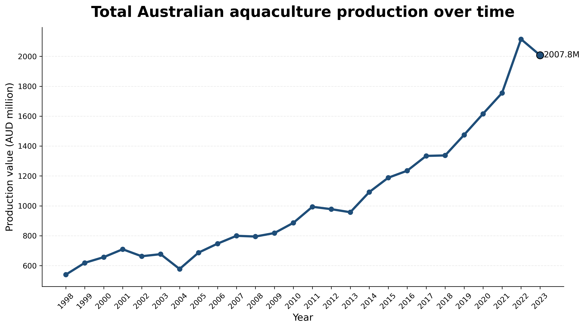
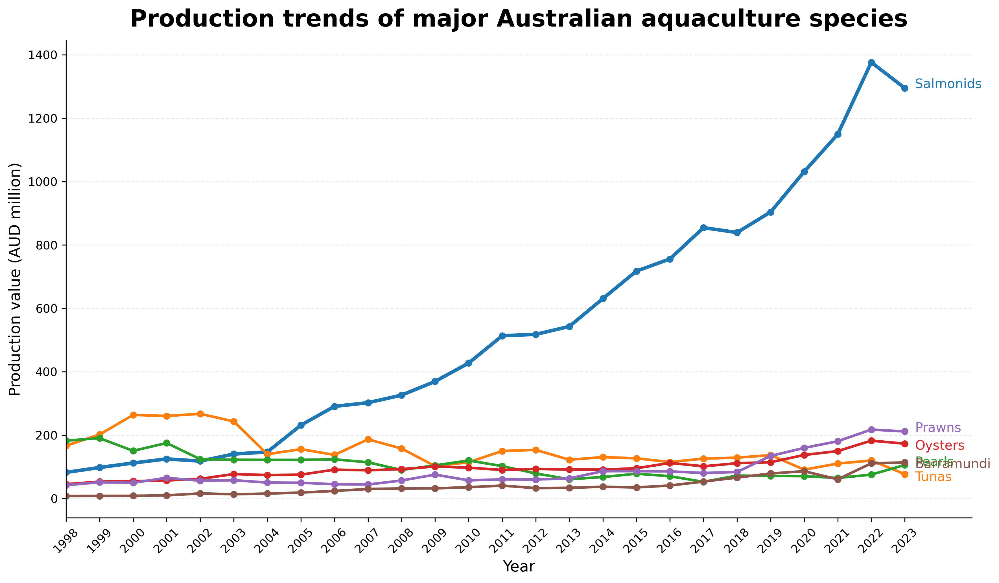
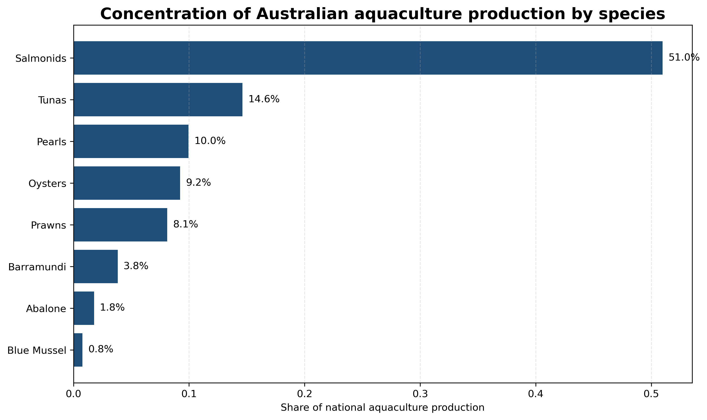
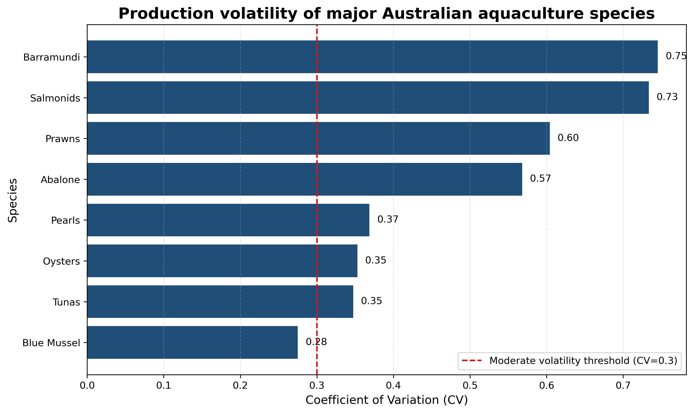
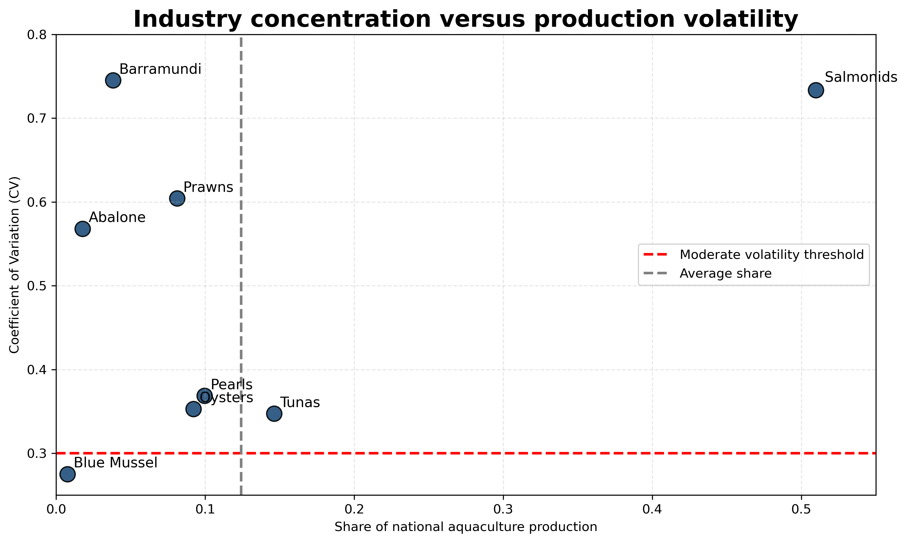

# Climate Risk Analytics for Aquaculture Regions in Australia


Data-driven exploration of climate exposure in Australia's aquaculture industry.

---

## Project Overview

Aquaculture is highly sensitive to environmental variability and extreme weather events. Climate change is increasing the frequency and intensity of events such as marine heatwaves, tropical cyclones, and extreme rainfall, which may affect aquaculture production systems.

This project applies data science techniques to analyse climate exposure across aquaculture regions in Australia. By integrating multiple climate datasets, the analysis aims to identify regions that may face higher exposure to climate variability and extreme weather events.

The project demonstrates how climate risk analytics can be applied to climate-sensitive industries such as aquaculture.

---

## Project Highlights

- Analysis of long-term **aquaculture production trends**
- Examination of **industry concentration across species**
- Measurement of **production volatility**
- Exploration of **industry concentration versus production risk**
- Foundation for analysing **climate exposure in aquaculture regions**

---

## Example Insight



Australian aquaculture production has expanded significantly over the past two decades, with **salmonids becoming the dominant contributor to industry value**.  
Understanding the structure and volatility of aquaculture production provides important context for assessing **climate exposure in climate-sensitive food systems**.

---

# Example Analysis

The repository includes exploratory analysis of **Australian aquaculture production data**.  
These analyses provide context for understanding how climate variability may affect aquaculture production systems across Australia.

---

## Total Aquaculture Production Trend


Australian aquaculture production has expanded substantially over the past two decades.  
The overall upward trend reflects the growing economic importance of aquaculture within Australia's seafood sector.  
This growth also highlights the increasing relevance of assessing climate-related risks that may affect long-term production stability.

---

## Major Species Production Trends



Production trends across major aquaculture species show strong structural differences within the industry.  
Salmonids dominate the sector and have experienced significant growth over time, while other species such as prawns, oysters, and tuna display more moderate and stable production patterns.  
Understanding these species-level dynamics helps identify which aquaculture sectors may be most exposed to environmental variability.

---

## Industry Concentration



Australian aquaculture production is highly concentrated among a small number of species.  
Salmonids account for a large share of national production value, indicating a relatively concentrated industry structure.  
High concentration may increase systemic risk if climate shocks affect the dominant species.

---

## Production Volatility



Production volatility varies considerably across aquaculture species.  
Some species exhibit relatively stable production levels, while others show greater year-to-year fluctuations.  
Higher volatility may indicate stronger sensitivity to environmental conditions, market factors, or biological constraints.

---

## Industry Concentration vs Production Volatility



This chart compares the **industry share of each species with its production volatility**.  
Species with both high production share and high volatility may represent higher systemic risk within the aquaculture sector.  
Such patterns can help highlight which aquaculture industries may require greater attention when assessing climate exposure and long-term production resilience.

---

## Why This Project Matters

Aquaculture is one of the fastest growing food production sectors globally, but it is also highly exposed to environmental variability and climate change.

Understanding regional climate exposure can help support:

- risk assessment for aquaculture operations
- climate adaptation planning
- ESG and sustainability reporting
- long-term planning for climate-sensitive food systems

This project demonstrates how data science methods can be used to analyse climate risks for real-world industries.

---

## Research Question

**How exposed are aquaculture regions in Australia to climate variability and extreme weather events?**

Sub-questions include:

- Which aquaculture regions are most exposed to extreme weather events?
- How has climate variability changed across these regions over time?
- Can climate datasets be used to build a regional climate exposure index?

---

## Project Objectives

1. Integrate multiple climate datasets relevant to aquaculture regions in Australia.
2. Analyse climate variability and extreme weather exposure.
3. Develop a simple **Climate Exposure Index** to compare regional risk levels.
4. Visualise climate exposure patterns using geospatial analysis.

---

## Methodology

The project follows a standard data science workflow.

### 1. Data Collection

Climate and environmental datasets relevant to aquaculture regions are collected.

### 2. Data Cleaning and Processing

Datasets are standardised and prepared for analysis.

### 3. Exploratory Data Analysis

Climate variability indicators such as:

- temperature anomalies  
- rainfall variability  
- extreme weather events  

are analysed across regions.

### 4. Climate Exposure Index Development

Selected indicators are combined to estimate **regional climate exposure levels**.

### 5. Visualisation and Mapping

Visualisations and geospatial analysis are used to highlight climate risk patterns.

---

## Tools Used

- **Python**
- **Pandas** – data cleaning and transformation
- **NumPy** – numerical operations
- **Matplotlib / Seaborn** – data visualisation
- **Jupyter Notebook** – exploratory data analysis

---

# Data Sources

The project integrates several publicly available datasets.

### Climate Data

**Bureau of Meteorology (BOM)**

- Temperature observations  
- Rainfall data  
- Extreme weather records  

**Sea Surface Temperature Data (NOAA / NASA)**

- Ocean temperature patterns relevant to coastal aquaculture  

**Cyclone Track Data (BOM)**

- Historical tropical cyclone paths affecting northern Australia  

### Aquaculture Data

Australian fisheries and aquaculture production statistics used to identify major aquaculture regions and industry structure.

---

## Key Techniques

This project applies several data science and geospatial analysis techniques, including:

- Data integration from multiple climate datasets
- Time series analysis of climate variability
- Exploratory data analysis (EDA)
- Construction of a composite Climate Exposure Index
- Geospatial visualisation of regional climate risks

The analysis is implemented using Python-based data science tools such as:

- Pandas for data processing
- NumPy for numerical operations
- Matplotlib / Seaborn for visualisation
- Geospatial analysis tools for mapping climate exposure across regions

---

## ESG Context

Frameworks such as the **Task Force on Climate-related Financial Disclosures (TCFD)** emphasise the importance of assessing **physical climate risks** for climate-sensitive industries.

Aquaculture is particularly exposed to environmental variability. This project contributes to the broader discussion of climate risk assessment by analysing regional exposure patterns in Australia's aquaculture sector.

---

## Repository Structure

```
aquaculture-climate-risk-analysis
│
├── data
│   Raw aquaculture production datasets
│
├── notebooks
│   Exploratory analysis and visualisation notebooks
│
├── figures
│   Exported charts used in the README and analysis
│
└── README.md
```
---

## Project Status

Project initiated: **March 2026**

This repository will be updated as the analysis progresses.

---

## Author

Peter Dong  
Master of Data Science – Queensland University of Technology
